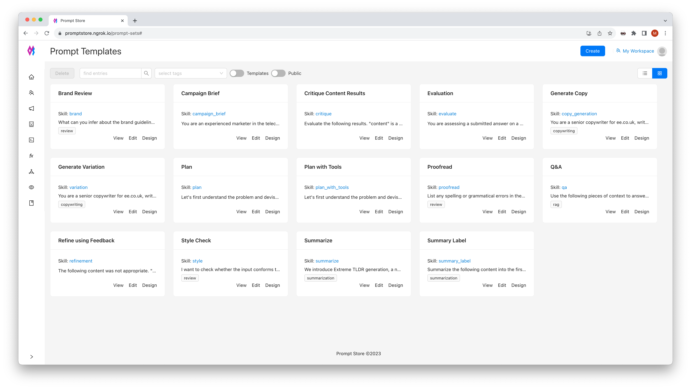

#  Prompt Store

    

Prompt Store is like a CMS (Content Management System) for prompts. We think
it's important that prompts be managed separately from code so they are 
visible, easily refined, and can be measured to improve the performance of
AI applications.

Prompt Store can be used as a Prompt Catalog to enable sharing of prompts and
to allow product owners, designers, business users, and governance peeps to
manage and tune prompts.

    

        
        
Create AI-powered Apps

    

    

        
        
Reusable Prompt Catalog

    

## Semantic Functions as a Service

While it's possible to consume prompts-as-a-service - integrating 
prompts with existing frameworks such as Langchain and Llama Index;
Prompt Store can also be used as your observability layer between 
applications and models to monitor cost, performance, and data usage.

A Semantic Function is the controller that ties the various components of model, prompt, semantic index, and guardrails together,
allowing a complete trace of interactions with models to facilitate
measurement, improvement, and governance.

    

        
        
Prompt Validation

    

    

        
        
Switch Models. Use Custom/Self-hosted Models.

    

    

        
        
Compose Multi-step Chains

    

    

        
        
Model Observability for Safety and Improvement

    

## Further Instructions

- [Installation](docs/installation.md)
- [Use cases](docs/use_cases.md)

## Further Reading

- [Documentation](https://promptstoredocs.devsheds.io)
